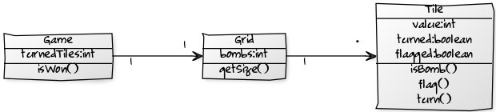
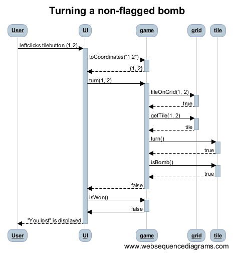
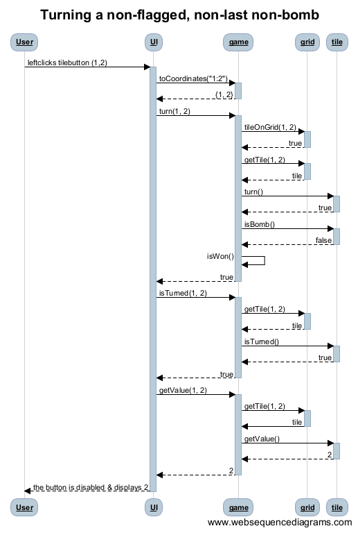
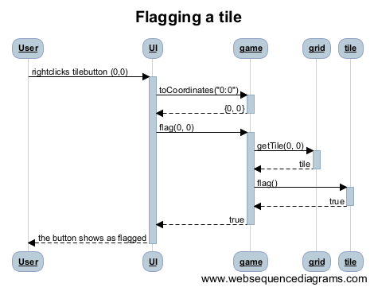

The aim of this project is to create a simple version of the
classic game minesweeper. The purpose of the game is to turn every
tile in a grid except the ones that represent bombs. Every turned
non-bomb tile displays the number of bombs adjacent to it.
When opening the program a new game automatically starts (unless I have
time to implement some kind of feature where the player can choose the
grid size and amount of bombs). 

###actors:
player

###actions:

- starting a new game
  - the current game is lost and a new one starts

- choosing the size of the grid and the amount of bombs (if there is time)

- turning a tile
  - if the tile is a bomb, the game is lost
  - if the tile is the last non-bomb tile, the game is won
  - otherwise the tile displays the number of adjacent bombs

- flagging/unflagging a tile

###Class Diagrams

###Sequence Diagrams

